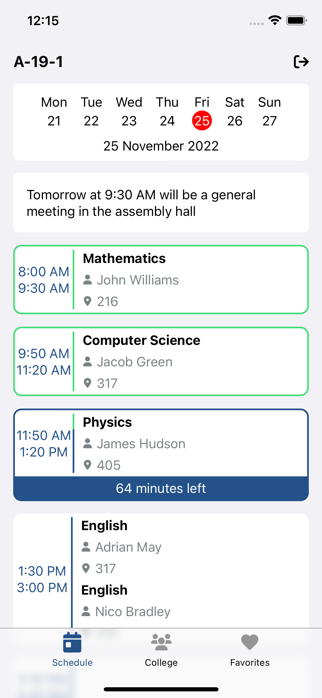
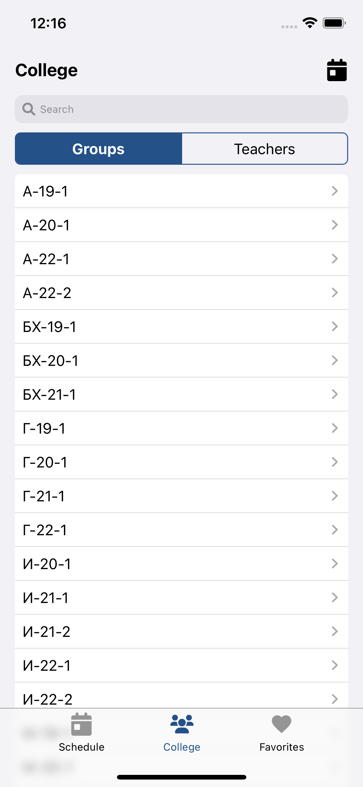
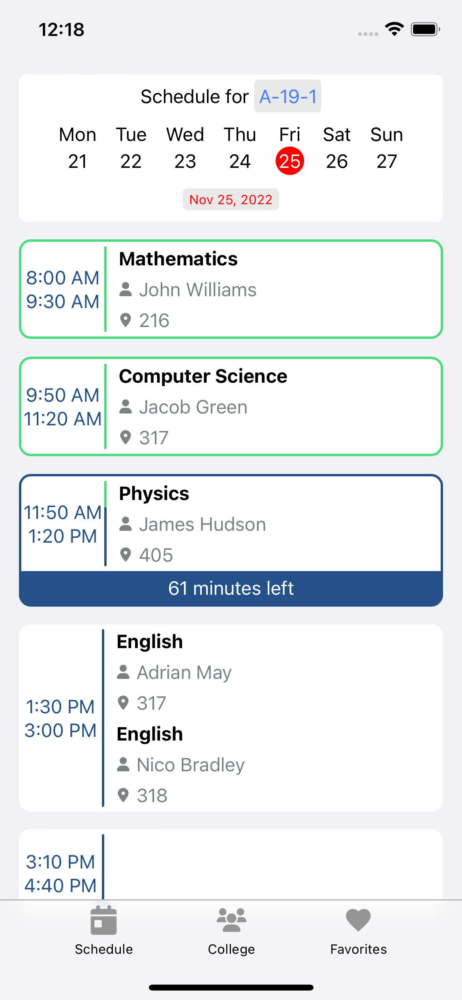
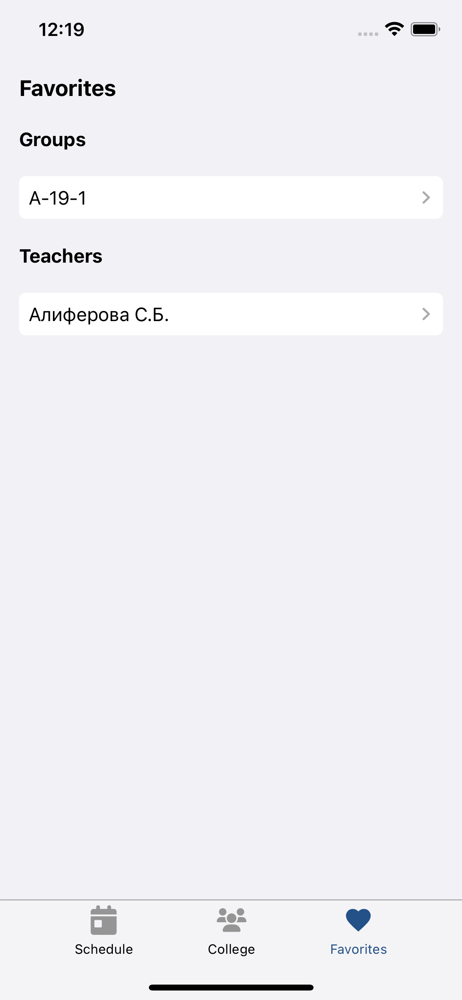

# inhk-pwa

This application is a "Progressive Web Application" (PWA) for the online schedule of the Nevinnomyssk College of 
Chemical Technology

## Demo

[Web demo](https://inhk.devcraft.ru)






## Setting Up

### Install

* Node.js (v16.15.1 or higher)
* NPM (v8.11.0 or higher)

### Then locally

```
$ npm install
$ npm run build
$ npm start
```

### Then on production

```
$ npm install
$ npm run deploy
$ npm start
```

## Start for development

```
$ npm run start-dev
```

## Build client app

```
$ npm run build
```

## Developed By

Dmitry Kologrivko  - <dmitrykologrivko@gmail.com>
